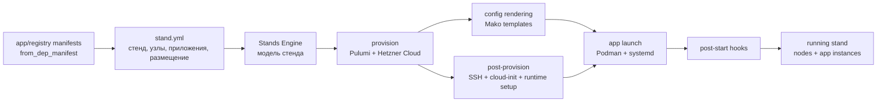

# Stands Engine

Stands Engine разворачивает инфраструктурный стенд из одного YAML-манифеста: поднимает серверы в Hetzner Cloud, готовит окружение через SSH, рендерит конфиги приложений и запускает контейнеры через Podman/systemd.

Главная идея Stands Engine - управлять инфраструктурой через модель стенда, а не через набор разрозненных слоев.

## Документация

Этот README даёт общий обзор проекта и быстрый старт. Исчерпывающие руководства
собраны в [разделе документации](docs/README.md):

- [описание переиспользуемых приложений](docs/application-manifest.md);
- [полный контракт манифеста стенда](docs/stand-manifest.md);
- [настройка и эксплуатация движка](docs/operations.md).

В классической схеме один запуск обычно распадается на несколько инструментов: Terraform/Pulumi создает ресурсы, Ansible или shell-скрипты доводят серверы до нужного состояния, Docker/Kubernetes-манифесты запускают приложения. Связи между этими слоями часто живут в CI, документации или договоренностях команды.

Stands Engine делает стенд основной единицей описания. В одном YAML-манифесте фиксируются серверы, профили железа, пользователи, приложения, роли, порты, шаблоны конфигурации, хуки и размещение инстансов по узлам. Дальше движок сам раскладывает эту модель на provision, post-provision и application layer.

> `create` создает реальные облачные ресурсы. Перед запуском проверьте токены, выбранные типы серверов, сеть, S3 backend Pulumi и стоимость ресурсов у провайдера.

## Как это выглядит



Один YAML описывает стенд как связанную модель, а Stands Engine переводит ее в конкретные действия: создать серверы, настроить узлы, отрендерить конфиги, запустить приложения и выполнить хуки.

## Когда полезен

- Нужно описывать dev, test или demo окружение как один воспроизводимый стенд, а не как набор несвязанных IaC, shell и app-манифестов.
- Важно видеть в одном месте, какие серверы нужны стенду, какие приложения на них живут, какие роли они выполняют и какие порты открывают.
- Хочется переиспользовать описания приложений между стендами, меняя только параметры запуска, набор инстансов и размещение по узлам.
- Нужен легкий слой управления стендом поверх Pulumi, SSH и Podman без полноценной платформы оркестрации.

Сейчас проект заточен под Hetzner Cloud, Pulumi Automation API, S3 backend для состояния, RHEL семейство Linux и Podman как runtime приложений.

## Что делает

Stands Engine берет модель стенда и проводит ее через несколько слоев исполнения:

- model layer: читает YAML, раскрывает вложенные `from_dep_manifest` и валидирует связи между стендом, профилями узлов, приложениями, ролями, реестрами и инстансами;
- provision layer: создает серверы Hetzner Cloud через Pulumi и привязывает к ним сеть, SSH key, cloud-init и labels стенда;
- post-provision layer: подключается по SSH, настраивает пользователей, firewalld, Podman, user systemd и сеть `app-net`;
- application layer: логинится в container registry, скачивает образы, рендерит Mako-шаблоны, загружает конфиги, запускает systemd user units и проверяет порты;
- hook layer: рендерит и выполняет post-start сценарии инстансов, если они объявлены в модели.

## Требования

- Python `>=3.14`
- `uv`
- Pulumi CLI в `PATH`
- аккаунт Hetzner Cloud и существующая SSH key в Hetzner
- существующая Hetzner network, указанная в `node_profiles.*.network`
- S3-совместимое хранилище для Pulumi state
- доступ к container registry, если образы закрытые

Зависимости Python описаны в [pyproject.toml](pyproject.toml).

## Установка

```bash
uv sync
```

После установки CLI доступен через `uv run`:

```bash
uv run stands-engine --help
uv run stands-engine create demo/stand.yml
```

Прежний вариант `python main.py ...` остается совместимым.

## Запуск в контейнере

OCI image содержит Python, зависимости проекта, Pulumi CLI и hcloud provider plugin. На машине оператора достаточно Docker или Podman; Podman на целевых серверах устанавливается самим движком и не связан с runtime, используемым для запуска Stands Engine.

Локальная сборка:

```bash
docker build -f Containerfile -t stands-engine:local .
# или
podman build -f Containerfile -t stands-engine:local .
```

Для повседневного запуска используйте launcher. Он автоматически выберет Podman или Docker, примонтирует текущий каталог только для чтения и сохранит ключи, configsets и connection output в `.stands-engine/`:

```bash
./stands-engine --env-file dev.env create demo/stand.yml
./stands-engine --env-file dev.env destroy demo/stand.yml
```

Явный выбор runtime или опубликованного image:

```bash
./stands-engine \
  --runtime docker \
  --image registry.example.com/stands-engine:0.1.0 \
  --env-file dev.env \
  create demo/stand.yml
```

PowerShell на Windows, macOS или Linux:

```powershell
.\stands-engine.ps1 create .\demo\stand.yml -EnvFile dev.env
.\stands-engine.ps1 destroy .\demo\stand.yml -EnvFile dev.env
```

Launcher переопределяет локальные абсолютные пути из env-файла контейнерными:

```env
STAND__PATH_TO_KEY=/data/keys/id_ed25519
STAND__PATH_TO_CONFIGSET=/data/configsets
OUTPUT__FILE_PATH=/data/output
```

Сам `dev.env`, другие `*.env`, приватные ключи, `.git` и локальные результаты исключены из build context и не копируются в image.

### Запуск без launcher

```bash
docker run --rm \
  --env-file dev.env \
  -e STAND__PATH_TO_KEY=/data/keys/id_ed25519 \
  -e STAND__PATH_TO_CONFIGSET=/data/configsets \
  -e OUTPUT__FILE_PATH=/data/output \
  -v "$PWD:/workspace:ro" \
  -v "$PWD/.stands-engine:/data" \
  registry.example.com/stands-engine:0.1.0 \
  create /workspace/demo/stand.yml
```

В CI передавайте секреты через защищенные переменные pipeline. Для воспроизводимого запуска используйте version tag или digest, а не изменяемый `latest`.

## Конфигурация

Настройки читаются из переменных окружения или файла `.env`. Вложенные секции задаются через `__`.

```env
HCLOUD__TOKEN=

S3__ACCESS_KEY=
S3__SECRET_KEY=
S3__REGION=
S3__ENDPOINT=
S3__BUCKET=

STAND__USER=
STAND__PASSPHRASE=
STAND__PATH_TO_KEY=
STAND__PATH_TO_CONFIGSET=

OUTPUT__CONSOLE=true
OUTPUT__CONSOLE_SECRETS=false
OUTPUT__FILE=false
OUTPUT__FILE_PATH=
```

Где:

- `HCLOUD__TOKEN` - токен Hetzner Cloud API.
- `S3__*` - backend Pulumi state.
- `STAND__USER` - владелец стенда; используется в имени backend-префикса и каталога configset.
- `STAND__PASSPHRASE` - passphrase для Pulumi secrets provider.
- `STAND__PATH_TO_KEY` - путь к приватному ключу стенда. Если файла нет, Stands Engine создаст ключ и сохранит его туда.
- `STAND__PATH_TO_CONFIGSET` - локальный каталог для отрендеренных конфигов приложений и хуков.
- `OUTPUT__CONSOLE` - печатать итоговый JSON с данными подключения после успешного `create`; по умолчанию `true`.
- `OUTPUT__CONSOLE_SECRETS` - показывать настоящие password и URL в консоли; по умолчанию они заменяются на `***`.
- `OUTPUT__FILE` - сохранять полный JSON с данными подключения в файл; по умолчанию `false`.
- `OUTPUT__FILE_PATH` - каталог для итогового JSON. Обязателен, если `OUTPUT__FILE=true`.

### Секреты манифеста

Строковые секреты можно не хранить непосредственно в YAML. Вместо значения укажите тег `!secret` и логическое имя:

```yaml
preferences:
  admin_user: cool_admin
  admin_pass: !secret redis-admin-password
```

Stands Engine преобразует имя в верхний регистр, заменяет дефисы на подчёркивания и добавляет префикс `SECRET_`. Для примера выше процесс должен получить переменную `SECRET_REDIS_ADMIN_PASSWORD`:

```bash
export SECRET_REDIS_ADMIN_PASSWORD='change-me'
```

Имя после `!secret` должно соответствовать шаблону `[A-Za-z][A-Za-z0-9_-]*`. Тег можно использовать для скалярного значения в основном манифесте или любом файле, подключённом через `from_dep_manifest`; использовать его для YAML-ключей, списков или mappings нельзя. Подставленное значение всегда имеет строковый тип и затем проверяется обычным валидатором манифеста.

Перед `create` движок проверяет сразу все ссылки. Отсутствующая или пустая переменная завершает команду до сборки стенда и облачных операций; сообщение содержит только имена переменных и пути в манифесте, но не их значения. При `destroy` можно не передавать секреты из `preferences` и `registries.*.username/password`, поскольку они не нужны для удаления. Секреты в структурных полях стенда и узлов остаются обязательными.

```bash
set -a
source dev.env
set +a
```

Механизм защищает секреты от хранения в исходных YAML, но не шифрует их после подстановки: отрендерованные configset-файлы по-прежнему могут содержать открытые значения.

## Быстрый старт

Демо-стенд находится в [demo/stand.yml](demo/stand.yml). Он поднимает Redpanda, Kafka UI, Redis и MongoDB на трех серверах и использует публичные Docker Hub образы.

```bash
set -a
source dev.env
set +a

python main.py create demo/stand.yml
```

Удаление стенда:

```bash
python main.py destroy demo/stand.yml
```

CLI сейчас намеренно небольшой:

```bash
python main.py <create|destroy> <path_to_stand_manifest>
```

## Манифест стенда

Манифест описывает желаемое состояние стенда целиком. Это не отдельный Terraform-файл, не inventory для post-provision и не deployment-манифест приложения, а связанная модель: какие узлы нужны, какие приложения существуют, какие инстансы приложений запущены и где они размещены.

Минимальная форма стенда:

```yaml
version: 1

stand:
  project: demo
  env: test
  users:
    sudo: av.rybin
    app: userapp
  ssh:
    key_name_admin: AVRybin

node_profiles:
  default:
    location: hel1
    type_serv: cpx32
    image: rocky-10
    network: network-p2p

from_dep_manifest: ./app-registry/registries.yml

apps:
  redis:
    from_dep_manifest: ./app-registry/redis/app.yml
    preferences:
      admin_user: cool_admin_ui
      admin_pass: "12345678"
    instances:
      master-redis:
        role: master-redis
        cpu: 1000
        ram: 2048
        oom_priority: 100

agents:
  apps: []

nodes:
  master-server:
    profile: default
    apps:
      - master-redis
```

Ключевые блоки:

- `stand` - имя проекта и окружения, пользователи на сервере, имя SSH key в Hetzner.
- `node_profiles` - ресурсные профили узлов: location, type, image, network и опционально `app_runtime`.
- `registries` - реестры образов, на которые ссылаются приложения. Обычно подключаются через `from_dep_manifest`; в одном стенде можно объявить несколько registry, а приложение выбирает нужный через `image.registry`.
- `apps` - каталог приложений стенда: образы, роли, порты, шаблоны, инстансы и параметры запуска.
- `agents.apps` - необязательный список инстансов, которые нужно запустить на каждой ноде стенда.
- `nodes` - размещение инстансов по конкретным узлам стенда.

`from_dep_manifest` можно использовать на любом уровне YAML mapping. Подключенный файл раскрывается на месте ключа, а относительные пути шаблонов и хуков нормализуются относительно файла, где они объявлены.

## Приложения-агенты

`agents.apps` использует те же имена инстансов, что и `nodes.<node>.apps`, но размещает их сразу на всех нодах:

```yaml
apps:
  dozzle:
    from_dep_manifest: ./app-registry/dozzle/app.yml
    instances:
      dozzle:
        role: logs-viewer
        cpu: 500
        ram: 512

agents:
  apps:
    - dozzle
```

На этапе build движок преобразует такой инстанс в обычные инстансы с именами `<instance>--<node>`, например `dozzle--master-server`. Эти имена используются как `instance.name`, имена контейнеров, ключи контекста `apps`, labels и директории configset. Исходного общего имени в собранной модели нет.

Agent-инстанс нельзя одновременно перечислять в `nodes.*.apps` или использовать как `connection_instance`. Сгенерированные имена должны быть уникальны и не могут совпадать с явно объявленными инстансами. Пустой список `agents.apps` разрешен; весь раздел `agents` можно не указывать.

## Описание приложения

Описание приложения - переиспользуемый фрагмент модели стенда. В нем фиксируются образ, роли, порты и шаблоны конфигурации, а конкретный стенд выбирает инстансы, preferences, hooks и размещение по узлам.

Пример:

```yaml
version: 1
name: redis

image:
  registry: docker
  path: library/redis
  version: 7.4.0-alpine3.20

roles:
  master-redis:
    ports:
      - number: 6379
        protocol: tcp
        zone: internal

templates:
  pod:
    path: redis-instance.yml.mako
    dest: /home/userapp/redis.yml
    owner: userapp
    mode: "644"
```

В стенде после этого остаются только параметры конкретного запуска: `preferences`, `instances`, `hooks`, ресурсы и размещение по `nodes`. Для каждого инстанса обязательны `cpu` в millicpu и `ram` в десятичных мегабайтах. Опциональный `oom_priority` задает Linux OOM score adjustment в диапазоне от `-1000` до `1000`.

В demo registry-файле `local` показывает пример приватного insecure registry с логином и паролем; текущие demo-приложения используют его для загрузки образов.

### Данные для подключения

Приложение может объявить отдельный Mako-шаблон с данными для подключения. В `app.yml` хранится только путь к нему:

```yaml
connection: connection.json.mako
```

Относительный путь вычисляется от каталога `app.yml`. В манифесте стенда необходимо выбрать инстанс, IP-адрес и роль которого получит шаблон:

```yaml
apps:
  redis:
    from_dep_manifest: ./app-registry/redis/app.yml
    connection_instance: master-redis
```

Пример `connection.json.mako`:

```mako
<%!
import json
%>{
  "endpoint": ${json.dumps(node.private_ip)},
  "port": 6379,
  "credentials": {
    "user": ${json.dumps(cluster.preferences.admin_user)},
    "password": ${json.dumps(cluster.preferences.admin_pass)}
  },
  "url": ${json.dumps("redis://" + node.private_ip + ":6379")}
}
```

Шаблон получает тот же контекст `node`, `instance`, `role`, `cluster` и `apps`, что и шаблоны запуска. Результатом должен быть один JSON-объект с непустыми `endpoint`, `credentials.user`, `credentials.password` и портом от `1` до `65535`. Поле `url` необязательно; внутри `credentials` можно добавлять параметры приложения.

После успешного запуска всех приложений и hooks Stands Engine объединяет результаты по именам приложений. Консольный результат по умолчанию маскирует password и весь URL. Файловый результат всегда содержит реальные значения, создаётся с правами `0600` и поэтому должен храниться как секрет. Имя файла формируется как `<user>_<project>_<env>.json` внутри `OUTPUT__FILE_PATH`, по тому же правилу, что и имя каталога configset.

Mako-шаблоны получают контекст:

- `node` - сервер текущего инстанса, включая IP-адреса после создания;
- `instance` - текущий инстанс приложения;
- `role` - роль инстанса и ее порты;
- `cluster` - приложение/кластер, образ и общие preferences;
- `apps` - все инстансы стенда, чтобы сервисы могли ссылаться друг на друга.

Если у инстанса указан `hooks`, путь должен вести в директорию с `hook.sh.mako`. Все файлы директории рендерятся, загружаются на сервер и `hook.sh` запускается после старта контейнера.

## Проверка манифеста

Перед сборкой стенда валидатор проверяет:

- наличие `stand`, `registries`, `apps`, `node_profiles`, `nodes`;
- обязательные поля `stand.project`, `stand.env`, `stand.users.*`, `stand.ssh.key_name_admin`;
- что каждый registry имеет `url`, а `username` и `password` заданы вместе;
- что образ приложения ссылается на существующий registry;
- что `app.name` совпадает с ключом приложения;
- что приложение с `connection` указывает принадлежащий ему `connection_instance`;
- что инстансы ссылаются на существующие роли;
- что для каждого инстанса заданы положительные целые `cpu` и `ram`, а опциональный `oom_priority` находится в диапазоне от `-1000` до `1000`;
- что узлы ссылаются на существующие профили;
- что каждый обычный инстанс размещен ровно на одном сервере;
- что `agents.apps` ссылается на уникальные существующие инстансы, не размещенные явно по нодам, а генерируемые имена не конфликтуют с другими инстансами;
- что agent-инстанс не используется как `connection_instance`;
- что все обязательные ссылки `!secret` имеют непустые значения в окружении.

Ошибки печатаются с путем к проблемному месту, например `manifest.apps.redis.instances.master-redis.role`.

## Структура проекта

- [main.py](main.py) - CLI-точка входа.
- [ManifestParser](ManifestParser) - parsing model: чтение YAML, раскрытие зависимых манифестов и проверка входного контракта.
- [StandBuilder](StandBuilder) - build model: преобразование проверенного словаря в объект стенда.
- [StandFramework](StandFramework) - stand lifecycle: provision, render configset, configure runtime, launch apps.
- [InfraBaseLib](InfraBaseLib) - provider и SSH primitives: Pulumi, Hetzner, cloud-init, upload operations.
- [ShellCollect](ShellCollect) - post-provision и runtime-команды для настройки узлов и запуска приложений.
- [App](App) - доменные модели приложений, ролей, образов и шаблонов.
- [demo](demo) - пример стенда и реестр приложений.

## Статус

Проект находится в активной разработке. Формат манифеста и внутренние API еще могут меняться.

Ближайшие задачи:

- стабилизировать входной контракт модели стенда;
- аккуратнее описать кастомизацию серверных профилей;
- яснее описать границы provider/runtime слоев;
- вынести секреты из демо и улучшить модель их передачи;
- расширить документацию по шаблонам, хукам и переиспользованию приложений.

## Лицензия

Проект распространяется по лицензии [Apache License 2.0](LICENSE).
Информация об авторских правах приведена в файле [NOTICE](NOTICE).
