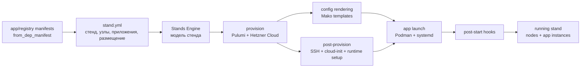

# Stands Engine

Stands Engine разворачивает инфраструктурный стенд из одного YAML-манифеста: поднимает серверы в Hetzner Cloud, готовит окружение через SSH, рендерит конфиги приложений и запускает контейнеры через Podman/systemd.

Главная идея Stands Engine - управлять инфраструктурой через модель стенда, а не через набор разрозненных слоев.

В классической схеме один запуск обычно распадается на несколько инструментов: Terraform/Pulumi создает ресурсы, Ansible или shell-скрипты доводят серверы до нужного состояния, Docker/Kubernetes-манифесты запускают приложения. Связи между этими слоями часто живут в CI, документации или договоренностях команды.

Stands Engine делает стенд основной единицей описания. В одном YAML-манифесте фиксируются серверы, профили железа, пользователи, приложения, роли, порты, шаблоны конфигурации, хуки и размещение инстансов по узлам. Дальше движок сам раскладывает эту модель на provision, post-provision и application layer.

> `create` создает реальные облачные ресурсы. Перед запуском проверьте токены, выбранные типы серверов, сеть, S3 backend Pulumi и стоимость ресурсов у провайдера.

## Как это выглядит



Один YAML описывает стенд как связанную модель, а Stands Engine переводит ее в конкретные действия: создать серверы, настроить узлы, отрендерить конфиги, запустить приложения и выполнить хуки.

## Когда полезен

- Нужно описывать dev, test или demo окружение как один воспроизводимый стенд, а не как набор несвязанных IaC, shell и app-манифестов.
- Важно видеть в одном месте, какие серверы нужны стенду, какие приложения на них живут, какие роли они выполняют и какие порты открывают.
- Хочется переиспользовать описания приложений между стендами, меняя только параметры запуска, набор инстансов и размещение по узлам.
- Нужен легкий слой управления стендом поверх Pulumi, SSH и Podman без полноценной платформы оркестрации.

Сейчас проект заточен под Hetzner Cloud, Pulumi Automation API, S3 backend для состояния, RHEL семейство Linux и Podman как runtime приложений.

## Что делает

Stands Engine берет модель стенда и проводит ее через несколько слоев исполнения:

- model layer: читает YAML, раскрывает вложенные `from_dep_manifest` и валидирует связи между стендом, профилями узлов, приложениями, ролями, реестрами и инстансами;
- provision layer: создает серверы Hetzner Cloud через Pulumi и привязывает к ним сеть, SSH key, cloud-init и labels стенда;
- post-provision layer: подключается по SSH, настраивает пользователей, firewalld, Podman, user systemd и сеть `app-net`;
- application layer: логинится в container registry, скачивает образы, рендерит Mako-шаблоны, загружает конфиги, запускает systemd user units и проверяет порты;
- hook layer: рендерит и выполняет post-start сценарии инстансов, если они объявлены в модели.

## Требования

- Python `>=3.14`
- `uv`
- Pulumi CLI в `PATH`
- аккаунт Hetzner Cloud и существующая SSH key в Hetzner
- существующая Hetzner network, указанная в `node_profiles.*.network`
- S3-совместимое хранилище для Pulumi state
- доступ к container registry, если образы закрытые

Зависимости Python описаны в [pyproject.toml](pyproject.toml).

## Установка

```bash
uv sync
```

## Конфигурация

Настройки читаются из переменных окружения или файла `.env`. Вложенные секции задаются через `__`.

```env
HCLOUD__TOKEN=

S3__ACCESS_KEY=
S3__SECRET_KEY=
S3__REGION=
S3__ENDPOINT=
S3__BUCKET=

STAND__USER=
STAND__PASSPHRASE=
STAND__PATH_TO_KEY=
STAND__PATH_TO_CONFIGSET=
```

Где:

- `HCLOUD__TOKEN` - токен Hetzner Cloud API.
- `S3__*` - backend Pulumi state.
- `STAND__USER` - владелец стенда; используется в имени backend-префикса и каталога configset.
- `STAND__PASSPHRASE` - passphrase для Pulumi secrets provider.
- `STAND__PATH_TO_KEY` - путь к приватному ключу стенда. Если файла нет, Stands Engine создаст ключ и сохранит его туда.
- `STAND__PATH_TO_CONFIGSET` - локальный каталог для отрендеренных конфигов приложений и хуков.

### Секреты манифеста

Строковые секреты можно не хранить непосредственно в YAML. Вместо значения укажите тег `!secret` и логическое имя:

```yaml
preferences:
  admin_user: cool_admin
  admin_pass: !secret redis-admin-password
```

Stands Engine преобразует имя в верхний регистр, заменяет дефисы на подчёркивания и добавляет префикс `SECRET_`. Для примера выше процесс должен получить переменную `SECRET_REDIS_ADMIN_PASSWORD`:

```bash
export SECRET_REDIS_ADMIN_PASSWORD='change-me'
```

Имя после `!secret` должно соответствовать шаблону `[A-Za-z][A-Za-z0-9_-]*`. Тег можно использовать для скалярного значения в основном манифесте или любом файле, подключённом через `from_dep_manifest`; использовать его для YAML-ключей, списков или mappings нельзя. Подставленное значение всегда имеет строковый тип и затем проверяется обычным валидатором манифеста.

Перед `create` движок проверяет сразу все ссылки. Отсутствующая или пустая переменная завершает команду до сборки стенда и облачных операций; сообщение содержит только имена переменных и пути в манифесте, но не их значения. При `destroy` можно не передавать секреты из `preferences` и `registries.*.username/password`, поскольку они не нужны для удаления. Секреты в структурных полях стенда и узлов остаются обязательными.

```bash
set -a
source dev.env
set +a
```

Механизм защищает секреты от хранения в исходных YAML, но не шифрует их после подстановки: отрендерованные configset-файлы по-прежнему могут содержать открытые значения.

## Быстрый старт

Демо-стенд находится в [demo/stand.yml](demo/stand.yml). Он поднимает Redpanda, Kafka UI, Redis и MongoDB на трех серверах и использует публичные Docker Hub образы.

```bash
set -a
source dev.env
set +a

python main.py create demo/stand.yml
```

Удаление стенда:

```bash
python main.py destroy demo/stand.yml
```

CLI сейчас намеренно небольшой:

```bash
python main.py <create|destroy> <path_to_stand_manifest>
```

## Манифест стенда

Манифест описывает желаемое состояние стенда целиком. Это не отдельный Terraform-файл, не inventory для post-provision и не deployment-манифест приложения, а связанная модель: какие узлы нужны, какие приложения существуют, какие инстансы приложений запущены и где они размещены.

Минимальная форма стенда:

```yaml
version: 1

stand:
  project: demo
  env: test
  users:
    sudo: av.rybin
    app: userapp
  ssh:
    key_name_admin: AVRybin

node_profiles:
  default:
    location: hel1
    type_serv: cpx32
    image: rocky-10
    network: network-p2p

from_dep_manifest: ./app-registry/registries.yml

apps:
  redis:
    from_dep_manifest: ./app-registry/redis/app.yml
    preferences:
      admin_user: cool_admin_ui
      admin_pass: "12345678"
    instances:
      master-redis:
        role: master-redis

nodes:
  master-server:
    profile: default
    apps:
      - master-redis
```

Ключевые блоки:

- `stand` - имя проекта и окружения, пользователи на сервере, имя SSH key в Hetzner.
- `node_profiles` - ресурсные профили узлов: location, type, image, network и опционально `app_runtime`.
- `registries` - реестры образов, на которые ссылаются приложения. Обычно подключаются через `from_dep_manifest`; в одном стенде можно объявить несколько registry, а приложение выбирает нужный через `image.registry`.
- `apps` - каталог приложений стенда: образы, роли, порты, шаблоны, инстансы и параметры запуска.
- `nodes` - размещение инстансов по конкретным узлам стенда.

`from_dep_manifest` можно использовать на любом уровне YAML mapping. Подключенный файл раскрывается на месте ключа, а относительные пути шаблонов и хуков нормализуются относительно файла, где они объявлены.

## Описание приложения

Описание приложения - переиспользуемый фрагмент модели стенда. В нем фиксируются образ, роли, порты и шаблоны конфигурации, а конкретный стенд выбирает инстансы, preferences, hooks и размещение по узлам.

Пример:

```yaml
version: 1
name: redis

image:
  registry: docker
  path: library/redis
  version: 7.4.0-alpine3.20

roles:
  master-redis:
    ports:
      - number: 6379
        protocol: tcp
        zone: internal

templates:
  pod:
    path: redis-instance.yml.mako
    dest: /home/userapp/redis.yml
    owner: userapp
    mode: "644"
```

В стенде после этого остаются только параметры конкретного запуска: `preferences`, `instances`, `hooks` и размещение по `nodes`.

В demo registry-файле также оставлен `local` как пример приватного insecure registry с логином и паролем. Текущий demo-стенд его не использует: все demo-приложения ссылаются на `docker`.

Mako-шаблоны получают контекст:

- `node` - сервер текущего инстанса, включая IP-адреса после создания;
- `instance` - текущий инстанс приложения;
- `role` - роль инстанса и ее порты;
- `cluster` - приложение/кластер, образ и общие preferences;
- `apps` - все инстансы стенда, чтобы сервисы могли ссылаться друг на друга.

Если у инстанса указан `hooks`, путь должен вести в директорию с `hook.sh.mako`. Все файлы директории рендерятся, загружаются на сервер и `hook.sh` запускается после старта контейнера.

## Проверка манифеста

Перед сборкой стенда валидатор проверяет:

- наличие `stand`, `registries`, `apps`, `node_profiles`, `nodes`;
- обязательные поля `stand.project`, `stand.env`, `stand.users.*`, `stand.ssh.key_name_admin`;
- что каждый registry имеет `url`, а `username` и `password` заданы вместе;
- что образ приложения ссылается на существующий registry;
- что `app.name` совпадает с ключом приложения;
- что инстансы ссылаются на существующие роли;
- что узлы ссылаются на существующие профили;
- что каждый инстанс размещен ровно на одном сервере.
- что все обязательные ссылки `!secret` имеют непустые значения в окружении.

Ошибки печатаются с путем к проблемному месту, например `manifest.apps.redis.instances.master-redis.role`.

## Структура проекта

- [main.py](main.py) - CLI-точка входа.
- [ManifestParser](ManifestParser) - parsing model: чтение YAML, раскрытие зависимых манифестов и проверка входного контракта.
- [StandBuilder](StandBuilder) - build model: преобразование проверенного словаря в объект стенда.
- [StandFramework](StandFramework) - stand lifecycle: provision, render configset, configure runtime, launch apps.
- [InfraBaseLib](InfraBaseLib) - provider и SSH primitives: Pulumi, Hetzner, cloud-init, upload operations.
- [ShellCollect](ShellCollect) - post-provision и runtime-команды для настройки узлов и запуска приложений.
- [App](App) - доменные модели приложений, ролей, образов и шаблонов.
- [demo](demo) - пример стенда и реестр приложений.

## Статус

Проект находится в активной разработке. Формат манифеста и внутренние API еще могут меняться.

Ближайшие задачи:

- стабилизировать входной контракт модели стенда;
- аккуратнее описать кастомизацию серверных профилей;
- яснее описать границы provider/runtime слоев;
- вынести секреты из демо и улучшить модель их передачи;
- добавить вывод данных для подключения к поднятому стенду;
- расширить документацию по шаблонам, хукам и переиспользованию приложений.

## Лицензия

Код можно использовать, копировать, изменять и распространять, в том числе в коммерческих проектах, при условии сохранения уведомления об авторе и лицензии.

Автор: Anatolii Rybin.

Copyright (c) 2026 Anatolii Rybin.
